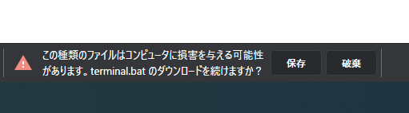
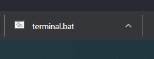
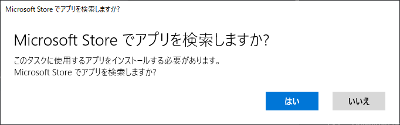

# 2年プログラミング授業用のやつ

#### [ここをクリックしてダウンロード](terminal.bat)

## 使用方法

1. 上記リンクをクリック
2. 以下のような画面になるので、「保存」をクリックする

3. 以下のような表示になったら、「terminal.bat」をクリックする

4. 「いいえ」をクリックする

5. Zドライブにファイルがコピーされるので、Enterを押す
6. 自動的にZドライブが開くので、そこから`terminal.bat`をダブルクリックする
